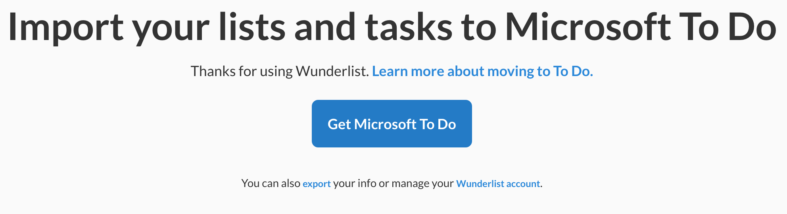
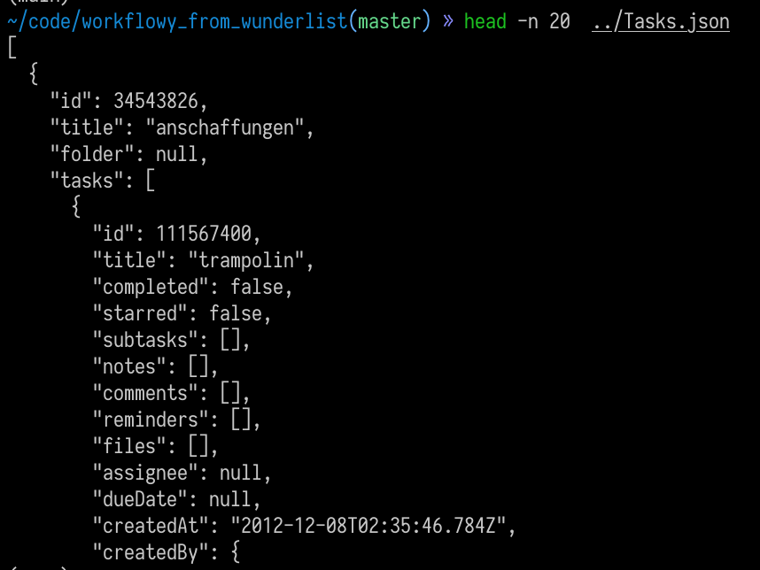
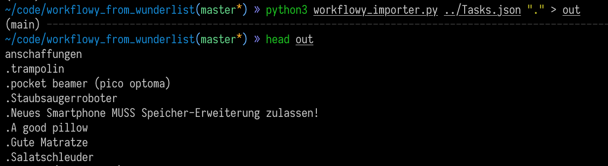
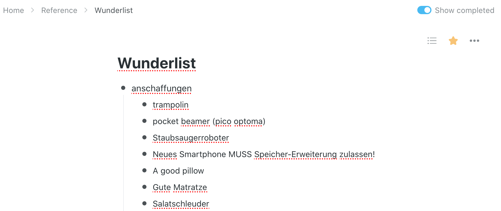

# Import your Wunderlist lists into Workflowy

## How To

### Export from Wunderlist

Go to [wunderlist.com](https://www.wunderlist.com/). Wunderlist is now part of Microsoft and you can move your Wunderlist content to Microsoft To Do. Under "Get Microsoft To Do" button, click "export" and download your data.

Unzip your downloaded data and note the JSON file. For me, it was called `Tasks.json`.

### Prepare import

Write all your Wunderlist content in Workflowy-readable format:

`python3 workflowy_importer.py ../Tasks.json` (or your differently-named JSON)

(Alternatively send it to a file and copy from there `python3 workflowy_importer.py ../Tasks.json > workflowy_import.txt`.)

### Import to Workflowy

Just copy the output of the previous command and paste it in Workflowy. If you already have other bullets in Workflowy I recommend to paste everything inside a bullet called "Wunderlist" and start sorting, moving, and deleting from there.

